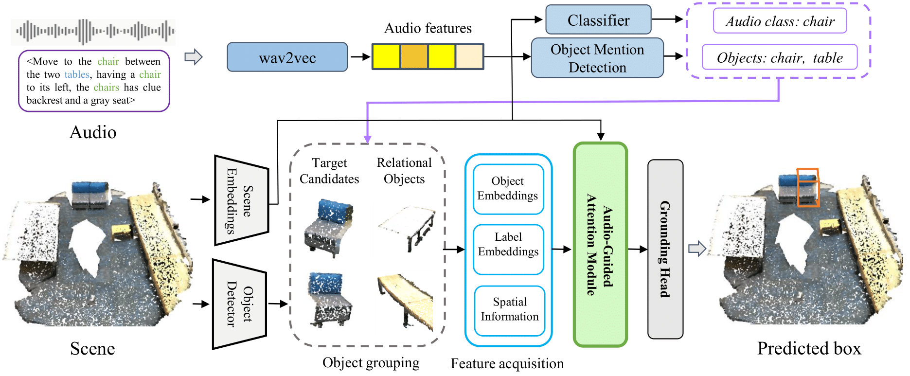
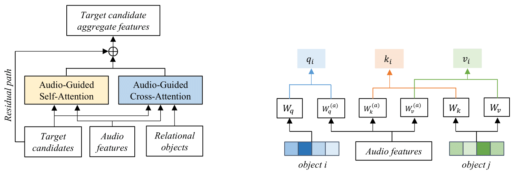

# Audio-3DVG
### Audio-3DVG: Unified Audio - Point Cloud Fusion for 3D Visual Grounding

This repository is official implementation of the paper: Audio-3DVG: Unified Audio - Point Cloud Fusion for 3D Visual Grounding


<p align="center"><em>Main pipeline</em></p>


<p align="center"><em>Audio-Guided Attention</em></p>

* **Abstract:**
3D Visual Grounding (3DVG) involves localizing target objects in 3D point clouds based on natural language. While prior work has made strides using textual descriptions, leveraging spoken language-known as Audio-based 3D Visual Grounding-remains underexplored and challenging. Motivated by advances in automatic speech recognition (ASR) and speech representation learning, we propose Audio-3DVG, a simple yet effective framework that integrates audio and spatial information for enhanced grounding. Rather than treating speech as a monolithic input, we decompose the task into two complementary components. First, we introduce (i) Object Mention Detection, a multi-label classification task that explicitly identifies which objects are referred to in the audio, enabling more structured audio-scene reasoning. Second, we propose an (ii) Audio-Guided Attention module that models the interactions between target candidates and mentioned objects, enhancing discrimination in cluttered 3D environments. To support benchmarking, we (iii) synthesize audio descriptions for standard 3DVG datasets, including ScanRefer, Sr3D, and Nr3D. Experimental results demonstrate that Audio-3DVG not only achieves new state-of-the-art performance in audio-based grounding, but also competes with text-based methods, highlight the promise of integrating spoken language into 3D vision tasks.

* **Citation:**
Please cite this paper: [https://arxiv.org/abs/2507.00669](https://arxiv.org/abs/2507.00669)

``` bibtex
@misc{Audio-3DVG,
      title={Audio-3DVG: Unified Audio -- Point Cloud Fusion for 3D Visual Grounding}, 
      author={Duc Cao-Dinh and Khai Le-Duc and Anh Dao and Bach Phan Tat and Chris Ngo and Duy M. H. Nguyen and Nguyen X. Khanh and Thanh Nguyen-Tang},
      year={2025},
      eprint={2507.00669},
      url={https://arxiv.org/abs/2507.00669},
}
```

## Setup
The code is tested on Ubuntu 20.04 LTS with **PyTorch 1.11 and CUDA 11.3** installed. 

```shell
conda install pytorch==1.11.0 torchvision==0.12.0 torchaudio==0.11.0 cudatoolkit=11.3 -c pytorch
```

Install the necessary packages listed out in `requirements.txt`, install related library if need:
```shell
pip install -r requirements.txt
```
After all packages are properly installed, please run the following commands to compile the MinkowskiEngine and PointNet++:
```shell
git clone --recursive "https://github.com/NVIDIA/MinkowskiEngine"
cd MinkowskiEngine
git checkout 02fc608bea4c0549b0a7b00ca1bf15dee4a0b228
python setup.py install --force_cuda --blas=openblas
```
```shell
cd model/external_tools/pointnet2
python setup.py install
```

### Data preparation
We follow InstanceRefer, please refer the link below for processing:
https://github.com/CurryYuan/InstanceRefer/tree/main

Beside, we support the inference data by following steps:

1. Acces the link: https://huggingface.co/datasets/caodinhduc/audio-3dvg/tree/main
2. Download the evaluation embeddings and place them in: data/contextual_val
3. Download the PointGroup data and place it in: data/scannet/pointgroup_data
4. Download the model checkpoint best_model.pth and place it in: checkpoint/best_model.pth 


### Inference
You can change parameters in `config/InstanceRefer.yaml`:
```shell
python -m scripts/inference --log_dir checkpoints
```

### Visualization
config the id appear in checkpoints/results, instead of doing steps above, we provide a few examples in this folder and it can be visualised as: 
```shell
python -m scripts/visualize --id 6226
```

## TODO

- [ ] Updating to the best version.
- [ ] Release codes for Sr3D and Nr3D datasets
- [ ] Release codes for training and evaluation


## Acknowledgement
This project is not possible without multiple great opensourced codebases. 
* [ScanRefer](https://github.com/daveredrum/ScanRefer)
* [PointGroup](https://github.com/Jia-Research-Lab/PointGroup)
* [InstanceRefer](https://github.com/mit-han-lab/torchsparse)
* [ReferIt3D](https://github.com/referit3d/referit3d)
## License
This repository is released under MIT License (see LICENSE file for details).
