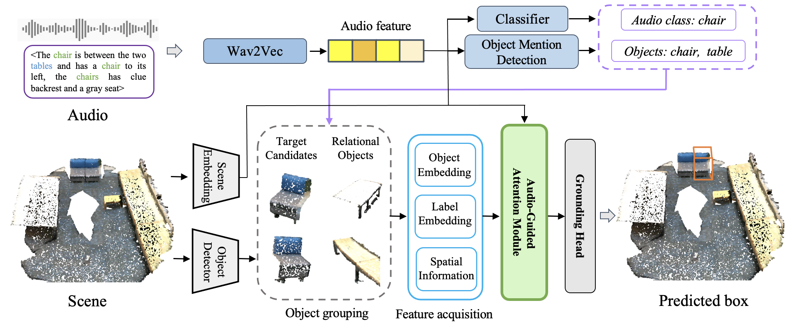

# Audio-3DVG
### Audio-3DVG: Unified Audio - Point Cloud Fusion for 3D Visual Grounding

This repository is official implementation of the paper: Audio-3DVG: Unified Audio - Point Cloud Fusion for 3D Visual Grounding




## Setup
The code is tested on Ubuntu 20.04 LTS with **PyTorch 1.11 and CUDA 11.3** installed. 

```shell
conda install pytorch==1.11.0 torchvision==0.12.0 torchaudio==0.11.0 cudatoolkit=11.3 -c pytorch
```

Install the necessary packages listed out in `requirements.txt`, install related library if need:
```shell
pip install -r requirements.txt
```
After all packages are properly installed, please run the following commands to compile the MinkowskiEngine and PointNet++:
```shell
git clone --recursive "https://github.com/NVIDIA/MinkowskiEngine"
cd MinkowskiEngine
git checkout 02fc608bea4c0549b0a7b00ca1bf15dee4a0b228
python setup.py install --force_cuda --blas=openblas
```
```shell
cd model/external_tools/pointnet2
python setup.py install
```

### Data preparation
We follow InstanceRefer, please refer the link below for processing:
https://github.com/CurryYuan/InstanceRefer/tree/main

Beside, we support the inference data by following steps:

1. Acces the link: https://huggingface.co/datasets/caodinhduc/audio-3dvg/tree/main
2. Download the evaluation embeddings and place them in: data/contextual_val
3. Download the PointGroup data and place it in: data/scannet/pointgroup_data
4. Download the model checkpoint best_model.pth and place it in: checkpoint/best_model.pth 


### Inference
You can change parameters in `config/InstanceRefer.yaml`:
```shell
python -m scripts/inference --log_dir checkpoints
```

### Visualization
config the id appear in checkpoints/results
```shell
python -m scripts/visualize --id 6226
```

## TODO

- [ ] Updating to the best version.
- [ ] Release codes for Sr3D and Nr3D datasets
- [ ] Release codes for training and evaluation


## Acknowledgement
This project is not possible without multiple great opensourced codebases. 
* [ScanRefer](https://github.com/daveredrum/ScanRefer)
* [PointGroup](https://github.com/Jia-Research-Lab/PointGroup)
* [InstanceRefer](https://github.com/mit-han-lab/torchsparse)
* [ReferIt3D](https://github.com/referit3d/referit3d)
## License
This repository is released under MIT License (see LICENSE file for details).